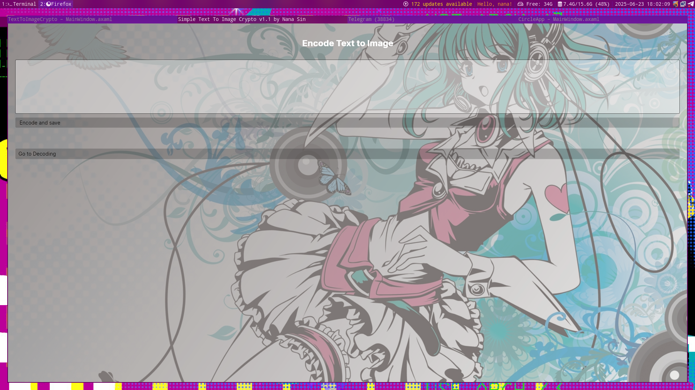

# Text to Image Crypto: Secure Steganography Application



## 🌟 Overview
Text to Image Crypto is a cutting-edge application that combines military-grade encryption with digital steganography to securely hide text messages within ordinary-looking images. Built with modern technologies and following MVVM architecture principles, this application provides a secure way to transmit sensitive information through seemingly innocent image files.

## 🔐 Key Features
- **Secure Encryption**: AES-GCM 256-bit encryption with password protection
- **Steganography**: Hide encrypted data within PNG images
- **Cross-Platform**: Runs on Linux (Arch), Windows, and macOS (on request)
- **Modern UI**: Clean, responsive interface built with Avalonia UI
- **Data Integrity**: Authentication tags ensure message authenticity
- **High Quality**: Images preserved at 100% quality with no compression artifacts

## 🛠 Technologies Used
| Technology | Purpose |
|------------|---------|
| **.NET 9.0** | Cross-platform runtime |
| **Avalonia UI** | Native cross-platform UI framework |
| **ReactiveUI** | MVVM framework with reactive extensions |
| **SkiaSharp** | 2D graphics library for image processing |
| **AES-GCM** | Military-grade encryption (256-bit) |
| **PBKDF2** | Secure password-based key derivation |
| **MVVM Architecture** | Clean separation of concerns |

## 📸 How It Works

### 🔒 Encoding Process
1. Enter your secret text
2. Set a strong password
3. Application encrypts text using AES-GCM
4. Encrypted data is embedded into image pixels
5. Save the resulting PNG image


### 🔓 Decoding Process
1. Load the encoded image
2. Enter the correct password
3. Application extracts encrypted data
4. Data is decrypted using AES-GCM
5. Original text is revealed


## ⚙️ System Requirements
- **OS**: Linux (Arch-based recommended), Windows 10+, macOS 10.15+ (on request)
- **Runtime**: .NET 9.0 SDK
- **Dependencies**: 
  - Linux: `libfontconfig1`, `libice6`, `libsm6`, `libx11-xcb-dev`
  - Disk Space: 50 MB minimum

## 🚀 Installation & Usage

### Installation on Linux
```bash
# Clone the repository
git clone https://github.com/your-username/text-to-image-crypto.git
cd text-to-image-crypto

# Install dependencies (Arch Linux example)
sudo pacman -S libx11 libinput mesa libxi libxcursor libxrandr fontconfig

# Build and run
dotnet run --project TextToImageCrypto


